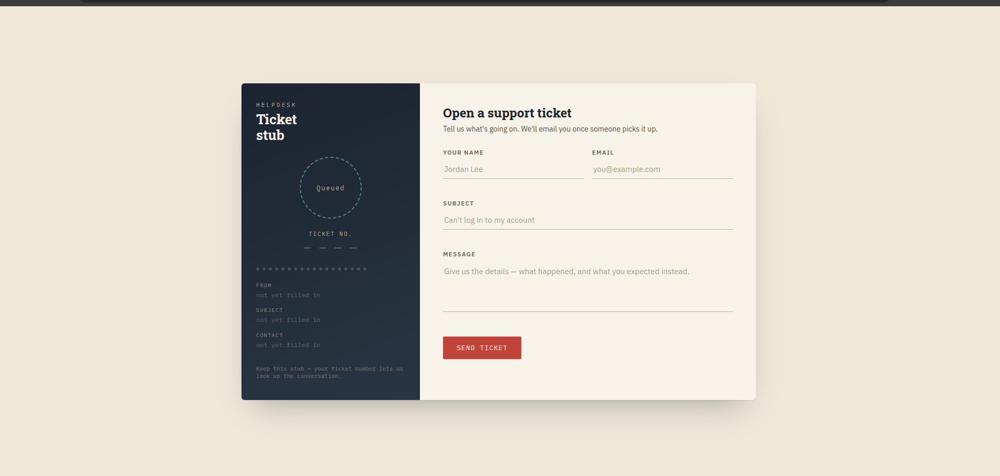
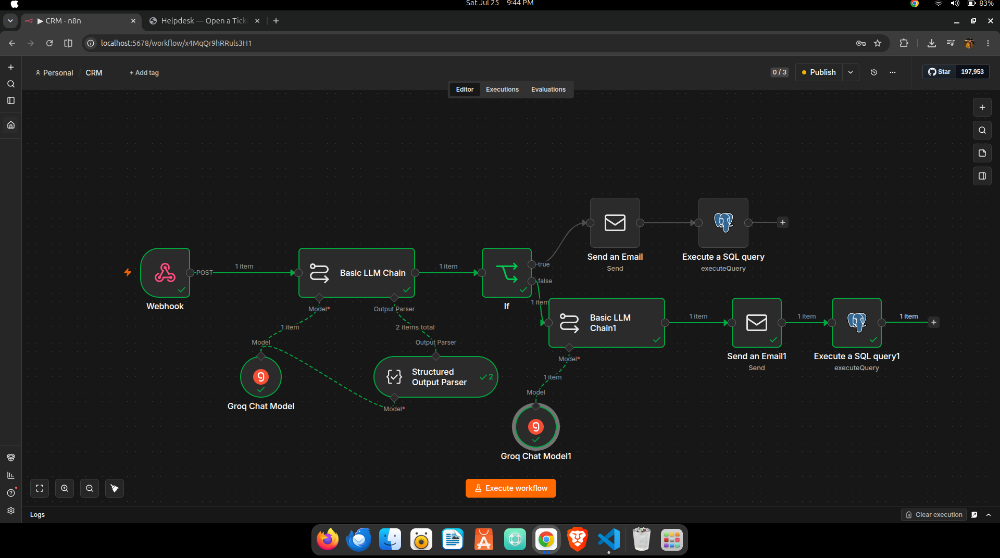
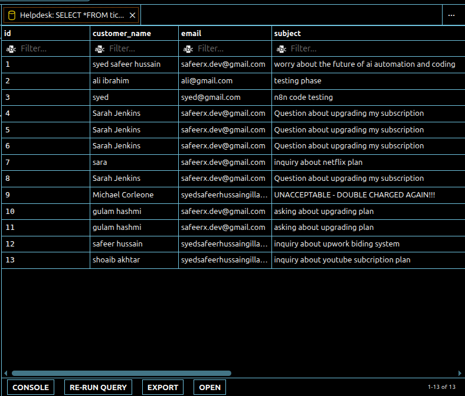

# AI-Powered Helpdesk & Escalation CRM (Event-Driven Architecture)

## Overview
This project is an automated, event-driven Customer Relationship Management (CRM) microservice. It captures support tickets via a web frontend, securely persists the data in a PostgreSQL database, and triggers an asynchronous n8n orchestration pipeline. An integrated Llama 3 AI model evaluates the ticket's sentiment and urgency to automatically route the data—either drafting and sending an automated resolution to the customer, or escalating angry users to human agents via real-time alerts.

## Visual Architecture

### 1. The Entry Point (Frontend Interface)
*Customers submit their queries here. The UI is completely decoupled from the AI processing to prevent HTTP timeouts.*

### 2. The Orchestration Engine (n8n Workflow)
*The core automation pipeline handling webhook ingestion, LLM inference, decision branching, and stateful database updates.*

### 3. The Single Source of Truth (PostgreSQL Database)
*Ticket states updated dynamically by the pipeline (`Pending`, `Resolved`, `Escalated`).*

## Business Logic & Project Goals
As an AI Automation Engineer, the goal of this project was to move beyond simple API wrappers and build a fault-tolerant backend system. 

Key engineering logic includes:
* **Persistence-First Handoffs:** The FastAPI server writes the ticket to PostgreSQL *before* triggering the AI pipeline. If the LLM API fails, no customer data is lost.
* **Deterministic AI Output:** Utilizing structured output parsers to force the Groq LLM to return strictly formatted JSON (`is_spam`, `sentiment`, `urgency`) to reliably control the execution flow.
* **Asynchronous Routing:** Bypassing synchronous web-server bottlenecks by using a "Respond Immediately" webhook pattern, allowing the heavy lifting (AI analysis and SMTP email dispatch) to happen in the background.

## Tech Stack
* **Backend API:** FastAPI (Python)
* **Database:** PostgreSQL (psycopg2)
* **Automation Orchestration:** n8n (Self-hosted via Docker)
* **AI Inference:** Groq API (Llama 3.1 8B Instant)
* **Frontend:** HTML/JS (Fetch API)

## Setup & Installation

### 1. Database Initialization
Execute the SQL schema to create the required table:
`psql -U postgres -d helpdesk_db -f schema.sql`

### 2. Start the API Server
Run the FastAPI backend to listen for frontend payloads:
`uvicorn main:app --reload`

### 3. Deploy the n8n Pipeline
1. Open your local n8n instance.
2. Select **Import from File** and upload `crm.json`.
3. Update the PostgreSQL and Groq credential nodes with your local environment variables.
4. Activate the workflow.
